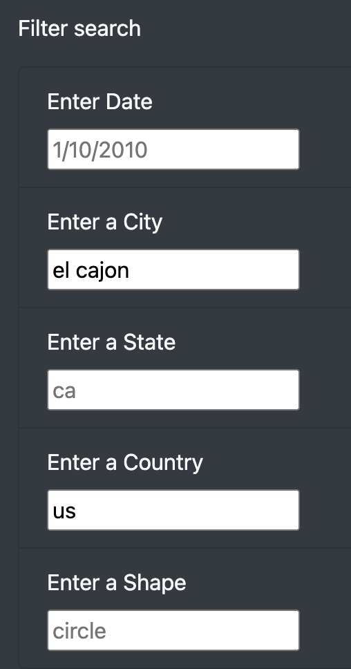
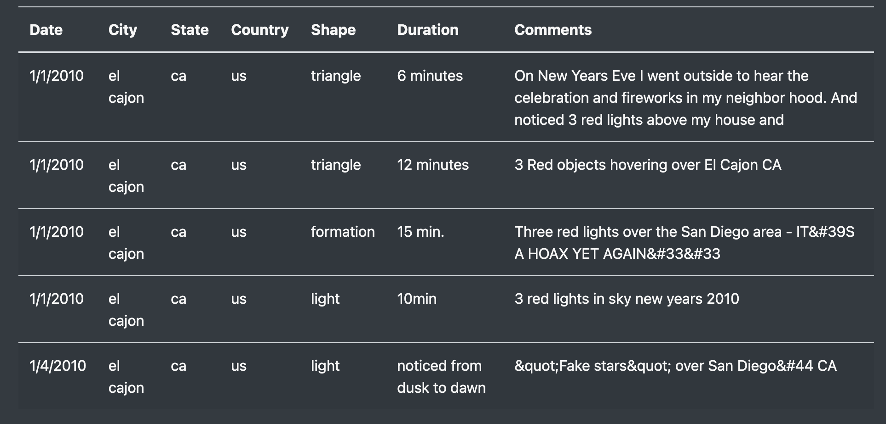

# UFO Challenge 

## Overview of the Analysis

### Purpose

The purpose of the analysis is to use javascript to manage information from a UFO sighting dataset and embed it in a webpage that can handle filtering in terms of date, city, state, country, and shape, of sightings. 

## Results

### On Filtering the Dataset

#### How?

The dataset can be filtered in terms of the five dimensions mentioned in the purpose section (see above) and to do so one needs only to writer out the conditions that one desires the output to meet. For example, one might filter for the city "el cajon" and the country "us", as shown in the following:

#### Output

Doing so will reload the dataset such that the output will be all sightings associated with the given criteria. In the case of sightings in "el cajon", "us", the output will look as the following:

## Summary

### Drawbacks

* The dataset does not satisfactorily adjust to the dimensions required by mobile devices.
* The title of the webpage is barely legible, it's color and the background's are very similar.

### Recomendations for Further Development. 

* Acommodate the possibility of exploring the dataset in a mobile device such that the user can fully visualize it without having to scroll.
* Change the color of the title or background such that the title is more easily legible.

